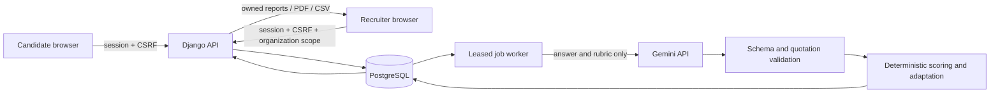

# Architecture and scoring

## Runtime and trust boundaries

React renders data and collects answers. For spoken answers, the candidate's browser obtains a one-use, short-lived, server-constrained Gemini Live token and sends microphone PCM directly to Gemini; the browser never receives the long-lived API key. The approved prompt and interviewer instruction are locked into the token, while the same approved prompt remains visible in the browser. Django owns authorization, question selection, timing, quotas, and scores. Browsers never receive expected answers, rubrics, or interim scores in candidate responses. Gemini output is untrusted and cannot directly select questions, write database rows, or invoke tools. Candidate code is parsed, never executed.

One web service serves the compiled frontend and authenticated API on the same origin. A supervised worker uses the database as a durable job queue, avoiding a paid broker or separate worker service. Jobs have five-minute leases, retries, and ownership tokens. Evaluation writes and next-question creation happen in a transaction; duplicate submissions cannot create duplicate evaluations. PostgreSQL workers use row locking with `skip_locked`. SQLite uses immediate transactions for local development.

Provider requests occur outside database transactions. A failed model response leaves the submitted answer stored and the job retryable. Four non-quota failures become an explicit failed state; candidate evaluation and recruiter narrative retry controls are provided. Quota failures wait without grading the answer as zero. A worker heartbeat lets the entry screen distinguish unavailable processing from a ready interview.

## Data model

| Entity | Relationships and purpose |
| --- | --- |
| User | Candidate or recruiter; unique normalized email, password hash, verification state. |
| Organization | One owner plus explicit admin/recruiter/reviewer/auditor memberships, with scoped positions, questions, and drives. |
| Position | Weighted skill topics, experience label, topic minimums, allowed difficulty bounds. |
| Question | Text/code prompt, expected answer, weighted concepts, critical misconceptions, reasoning rubric, code structure checks, version. |
| Drive | Position, opening/expiry, question count, time budget, instructions. Publishing freezes the question pool and role policy. |
| Invitation | One drive/email pair, high-entropy token digest, expiry, redemption, accommodation multiplier. |
| Interview | One invitation/candidate, ability distributions, active-tab identity, answering time, completion reason. |
| Attempt | Ordered immutable question snapshot, draft, final answer, issued/submitted times, adaptive selection reason, clarification count, and idempotency ID. |
| Evaluation | One per attempt: score components, evidence offsets, model, rubric version, confidence and flags. |
| Report | One per interview: weighted aggregate, topic results, recommendation, narrative status, grounded insights. |
| ReviewDecision | Recruiter's own decision and notes, kept separately from the system recommendation. |
| Job / WorkerStatus | Durable email/evaluation/report work and readiness. |
| AuthToken / RateBucket / AuditEvent | One-use verification/reset links, persistent throttles, minimal security audit metadata. |
| Embedding | Content-and-model-keyed cached vectors, without duplicated raw answer text. |

UUIDs prevent trivial enumeration but are never treated as authorization. Recruiter queries require the owning organization. Candidate queries require the session owner and verified candidate role.

## Adaptive selection, version 1

This is an explainable **uncalibrated partial-credit heuristic**, not a validated psychometric IRT instrument.

1. Ability is represented on the grid `theta = -3, -2.9, ... 3`. The initial weights are a normalized standard-normal prior. Maintain a global distribution, one per topic for selection, and one technical-only distribution per topic for reporting.
2. Difficulty `b` is -1, 0, or 1. For each grid point, `p = sigmoid(theta - b)`. Given normalized answer quality `q`, update `w' = w * [p^q * (1-p)^(1-q)]`, then normalize. The reporting distribution uses technical accuracy for `q` and raises the likelihood to the question's scoring weight.
3. The first question is medium. Publication requires medium questions and a sufficient role-specific pool.
4. Prefer topics not yet seen; subsequently choose the largest weighted coverage deficit: `(answered + 1) * topicWeight / totalWeight - answeredInTopic`. Only topics with remaining questions participate. This prevents one strong topic from consuming the entire interview.
5. Target difficulty is `0.7 * mean(topic) + 0.3 * mean(global)`. Add 0.15 when the last score is at least 70 and the answer was within its accommodated expected time. Subtract 0.15 when it took more than 1.5 times that time. Pick the available difficulty closest to the target, preferring a change of at most one level. A seeded hash resolves ties consistently within an interview. Never repeat a question.
6. Stop at the configured question limit (default 12), answering budget (default 35 minutes), or exhausted pool. No early stopping on an unvalidated confidence claim. AI processing pauses the clock; once a new question is issued, its server timer runs, including offline time. On expiry, the last timely saved draft is submitted.

## Per-question evaluation

All component values below are normalized to 0..1 before conversion to percentages.

- **Semantic similarity:** independently embed answer and expected-answer chunks into 768 dimensions. For each expected chunk, find the best cosine similarity to an answer chunk, average, then clamp `(cosine - 0.25) / 0.65` to 0..1. This mapping is versioned policy, not empirically calibrated truth. Embedding cache keys include the model, so model changes cannot mix vector spaces.
- **Concept coverage:** Gemini assesses each required concept as absent (0), partial (0.5), or supported (1). Divide the weighted coverage sum by total concept weight. Every nonzero concept needs a verbatim answer quote; fabricated quotes, missing indices, duplicate indices, and out-of-range grades are rejected. Contradictions require evidence too.
- **Reasoning and communication:** Gemini grades 0..4 against a fixed anchored instruction, then divide by four. Positive reasoning requires an exact supporting quote. The prompt explicitly avoids demographic inference and penalties for language variety. This does not prove freedom from model bias.
- **Static code structure:** Python AST or tree-sitter JavaScript/TypeScript parser validates syntax and detects rubric-selected structures. Valid syntax contributes 0.4, requested structure coverage contributes 0.6. This is not execution correctness. Critical concept contradictions or invalid syntax cap technical accuracy at 0.4.
- **Technical accuracy:** text = `0.30 * semantic + 0.70 * coverage`; code = `0.15 * semantic + 0.55 * coverage + 0.30 * structure`.
- **Question quality:** `0.75 * technical + 0.20 * reasoning + 0.05 * communication`.
- **Time efficiency:** `min(1, accommodatedExpectedSeconds / elapsedSeconds) * quality`. Speed alone cannot make a wrong answer strong. Accommodation applies both to timing and adaptive speed signals.

Blank answers are deterministically zero. Large semantic/coverage disagreement or declared model uncertainty flags human review. Store component values, evidence offsets, rubric version, and model alongside every evaluation. Temperature zero reduces variation but does not make provider inference fully deterministic.

## Final report

For each topic, show both raw question-weighted technical accuracy and a difficulty-adjusted value `100 * sigmoid(mean(technical ability))`. Technical score is the skill-weighted mean of those adjusted topic values. Reasoning, communication, and efficiency are question-weighted means. Consistency is `max(0, 100 - 4 * weightedStandardDeviation(topicScores))`.

`overall = 60% technical + 20% reasoning + 10% communication + 5% efficiency + 5% consistency`.

Default recommendations: 75+ hire, 55..74.9 borderline, below 55 no-hire. Falling below a required topic minimum prevents a hire recommendation. Missing topics, review flags, or fewer than two answers per target topic produce `needs_review`. Confidence is low or medium; the UI never presents an unsupported statistical certainty.

Gemini generates strengths, development areas, and a summary from the stored transcript and fixed scores. Every insight must reference an existing attempt and an exact quote. Quote existence is checked mechanically; whether an observation logically follows remains a human-review responsibility. Recruiter review is recorded separately and no employment decision is automatically sent to a candidate.

## Decisions made for this build

- Session cookies instead of browser-stored JWTs: simpler revocation and smaller token-exposure surface for a single-origin app.
- Custom CSS and locally bundled typography: a distinctive visual identity without a large UI framework or third-party font requests.
- Database job queue instead of Redis/Celery: durable processing with fewer free-tier dependencies.
- Static code checks instead of untrusted code execution: no safe continuously available free sandbox was assumed. The UI and PDF disclose that code was not run.
- SQLite only for zero-setup local development; PostgreSQL for durable hosting.
- A fixed question/time budget instead of confidence convergence, because this question bank is not calibrated.
- Workspace memberships are implemented for owner/admin/recruiter/reviewer/auditor access. Video recording/proctoring is intentionally excluded: the live room streams microphone PCM directly to Gemini and stores no media files.
